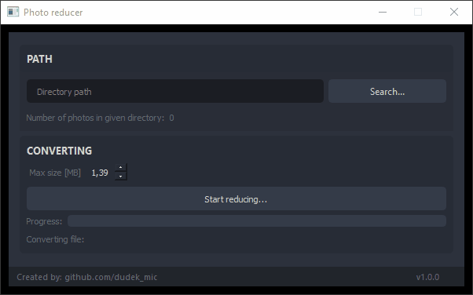

# Photo reducer

This program lets you reduce all photos from specified directory to given size.
You don't need to install anything to use it.
Original photos will not be changed.
Reduced photos will be created at <specified_directory>/reduced_photos.


# Manual

## Usage without installation

Double click on build from **bin/** directory.
> **Note:** Select a proper version for your operating system.



## Installing dependencies
```bash
pip3 install -r requirements.txt
```

## Creating a build
```bash
pyinstaller photo-reducer.py --clean --noconfirm --noconsole --onefile --name photoreducer
```
> **Note:** This project can be built on Windows, Mac OS, GNU/Linux, FreeBSD and every other OS supporting Python3.
